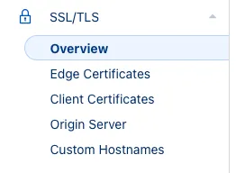

import imageAuthor from '@/images/team/noella-spitz.jpg'

export const article = {
  date: '2025-03-15',
  title: 'Full Guide to Deploy Production NodeJS Web App on AWS EC2 with SSL, Nginx, Docker',
  description:
    'A comprehensive guide to deploying a Node.js application to production on AWS EC2, complete with SSL certificates, Nginx configuration, and Docker containerization.',
  author: {
    name: 'Noella Spitz',
    role: 'Full Stack Developer & Blockchain Engineer',
    image: { src: imageAuthor },
  },
}

export const metadata = {
  title: article.title,
  description: article.description,
}

*By Noella Spitz*

In this guide, we will cover deploying a NodeJS application onto an AWS EC2 server (or any server of your choice). Whether you're setting up your first production environment or looking to improve your current deployment process, this walkthrough will help you establish a secure, scalable infrastructure.

<TopTip>
  This guide is comprehensive but modular. If you don't want to use Docker, you can skip that section and just make sure Nginx points to the correct port where your application is running.
</TopTip>

## Prerequisites

Before we begin, make sure you have:
- An EC2 instance you can SSH into
- A domain registered on Cloudflare

## Understanding the Infrastructure


The diagram above illustrates how this setup will be configured. Starting from the client, when they make a request to your domain they will be proxied through [Cloudflare](https://www.cloudflare.com/) to your public EC2 IP. The client-Cloudflare connection will be encrypted through Cloudflare's free edge certificate, and this serves as a **reverse proxy** to hide the IP address of your EC2 instance. The Cloudflare-Origin Server connection is encrypted with a Cloudflare Origin Certificate, which we will set up in this guide.

When the request hits your server, it will reach [Nginx](http://nginx.org/), which acts as a **load-balancer** and **port-forwarder**. This will take the request to the correct port on your system where your Dockerized application is listening for incoming requests.

## Dockerizing your Application

[Docker](https://www.docker.com/) is a service that allows you to run code within isolated containers. Containers are like a virtual machine, with its own operating system and create a sandbox environment to run code. [Docker Compose](https://docs.docker.com/compose/) is a tool for defining and running multi-container applications. It automates the build process and allows us to run the program, with features such as restart on failure, similar to PM2 or Node Forever.

### Dockerfile

To Dockerize your application, first create a `Dockerfile` in the root of your project:

```
# syntax=docker/dockerfile:1
FROM node:22-alpine
WORKDIR /app
COPY package*.json ./
RUN npm install --global nodemon
RUN npm install
COPY . .
ENV NODE_ENV=production
EXPOSE 8000
CMD ["npm", "start"]
```

The `FROM` command specifies building a container from a base image. Docker provides many different [images](https://hub.docker.com/) with different preinstalled software and operating systems. In this example, we use the Node image, as we want to run a NodeJS API, and this will have npm and NodeJS preinstalled.

<TopTip>
  Create a `.dockerignore` file to prevent unnecessary files from being copied into your Docker image: `node_modules` and `dist` are good candidates to exclude.
</TopTip>

### Docker Compose

Now let's set up Docker Compose. Create a `docker-compose.yml` file:

```yaml
services:
  my-app:
    image: node:22-alpine
    expose:
      - "8000"
    ports:
      - "8000:8000"
    build:
      context: .
      dockerfile: Dockerfile
    volumes:
      - .:/app
      - /app/node_modules
    working_dir: /app/
    env_file:
      - .env
    restart: on-failure
```

In this file we list the 'services', here we have named it 'my-app'. We specify the base image and tell it which ports to expose — the same as in the Dockerfile. We then provide build information — the Dockerfile path and the 'context', which is the path to your code relative to the `docker-compose.yml` file.

**Volumes** specify the persistent data generated by containers, which means that when the container is stopped, this data will still exist and not be deleted.

You can test your Docker setup locally by running:

```bash
docker-compose build
docker-compose up
```

## Getting an SSL Certificate from Cloudflare



### Edge Certificate

The first step is to secure the Client-Cloudflare connection. Cloudflare already has this set up, so we just have to enforce it. On your Cloudflare dashboard, navigate to the **SSL/TLS** section on the sidebar, and go to **Overview**.

In the first setting, you will be able to change your encryption mode. Under the **SSL/TLS encryption** section click **Configure** and select the **Custom SSL/TLS** option and set it to **Full (Strict)**.

Don't forget to click 'save' when you are done! This enforces strict encryption across the entire connection. Now, on the sidebar, navigate to the **Edge Certificates** tab. Scroll down and enable the **Always Use HTTPS** option.

### Origin Certificate

The next step is to secure the Cloudflare-Origin Server connection. This process requires Nginx, so in this step, we will just download the certificate and key and later you will see how to register it with Nginx.

On the sidebar, under **SSL/TLS**, and go to **Origin Server**. Under the **Origin Certificates** section, click the **Create Certificate** button.

Leave the default settings, but add additional hostnames if needed- if you will be using subdomains make sure you have _\*.your-domain.com_ and _your-domain.com_ listed as hostnames.

<TopTip>
  Store your certificate and private key in a secure password manager or protected file — never share these with anyone.
</TopTip>

## Installing Docker and Nginx on EC2

Now we need to install Docker and Nginx on our server. The EC2 instance used in this tutorial runs on Amazon Linux 2, so depending on your OS you may have to adjust the commands.


### Installing Docker and Docker Compose on Amazon Linux 2

Start by updating `yum`:

```bash
sudo yum update
```

Install Docker:

```bash
sudo yum install docker
```

Add group membership for the default ec2-user so you can run all docker commands without using the sudo command:

```bash
sudo usermod -a -G docker ec2-user
id ec2-user
newgrp docker
```

Install Docker Compose:

```bash
wget https://github.com/docker/compose/releases/latest/download/docker-compose-$(uname -s)-$(uname -m)
sudo mv docker-compose-$(uname -s)-$(uname -m) /usr/local/bin/docker-compose
sudo chmod -v +x /usr/local/bin/docker-compose
```

Enable Docker service to start on system boot:

```bash
sudo systemctl enable docker.service
sudo systemctl start docker.service
```

### Installing Nginx on Amazon Linux 2

Install with `yum`:

```bash
sudo yum install nginx
sudo systemctl start nginx
```

Anytime you make changes to the nginx config, you will have to do:

```bash
sudo systemctl restart nginx
```

## SSL and Port Forwarding with Nginx

Nginx is a powerful web server that can be used as a reverse proxy, and load balancer, amongst other capabilities. In this solution, we will use it as a proxy and port forwarder, to direct all incoming requests to the correct port.

First, SSH into your EC2 instance and save your certificate and private key:

```bash
sudo nano /etc/ssl/www.<YOUR DOMAIN>.com.pem
```

Paste your certificate into the terminal editor and save the file (^X, return, return). Do the same with your key file, but set the filename as: `/etc/ssl/www.<YOUR DOMAIN>.com.key`

To configure nginx, edit the configuration file:

```bash
sudo nano /etc/nginx/nginx.conf
```

Now replace the current `server` section with:

```nginx
server {
    # Listen to HTTPS port - port 443
    listen 443 ssl;
    listen [::]:443 ssl;
    server_name .com www.<YOUR DOMAIN>.com; # Replace with your actual domain name

    ssl_certificate /etc/ssl/www.<YOUR DOMAIN>.com.pem; # Path to certificate
    ssl_certificate_key /etc/ssl/www.<YOUR DOMAIN>.com.key; # Path to certificate key

    access_log /var/log/nginx/nginx.vhost.access.log;
    error_log /var/log/nginx/nginx.vhost.error.log;

    location / {
        proxy_pass http://0.0.0.0:<YOUR PORT>; # Where to forward url to
        proxy_http_version 1.1;
        proxy_set_header Upgrade $http_upgrade;
        proxy_set_header Connection 'upgrade';
        proxy_set_header Host $host;
        proxy_cache_bypass $http_upgrade;
    }
}
```

<TopTip>
  For each program you deploy and every subdomain you associate with it, you will need to add a new server block and define the subdomain under the `server_name` section.
</TopTip>

After editing, check your Nginx configuration for any errors:

```bash
sudo nginx -t
```

If all is good, restart the Nginx service to apply the changes:

```bash
sudo systemctl restart nginx
```

## Deploying on EC2

The first thing to check is to make sure your EC2 [Security Groups](https://docs.aws.amazon.com/AWSEC2/latest/UserGuide/ec2-security-groups.html) are configured correctly. Make sure you have created a security group that allows incoming requests on port 443 from all IPv4 and IPv6 addresses. This makes your HTTPS port publicly available.


To deploy, get your code onto the EC2 instance, whether you use GitHub and `git clone` or an SSH copy command.

When the code is ready, `cd` into the code's root directory and build the Docker container:

```bash
docker-compose build
```

Once it has built, you can now run the container in the background (`-d` flag):

```bash
docker-compose up -d
```

To view the application logs, simply:

```bash
docker-compose logs
```

And there you go! Your program should be available on your domain. 🎉

## About the Author

<div className="flex items-start gap-6 mt-8">
  
  <div>
    <h3 className="font-display font-semibold text-xl text-neutral-950">Noella Spitz</h3>
    <p className="text-sm text-neutral-600 mb-4">Full Stack Developer & Blockchain Engineer</p>
    
    <p className="mb-4">Noella is a software engineer by trade and a biomedical engineer by degree, with diverse expertise spanning blockchain, mobile, and web development. Half German and half Indonesian, she grew up in Indonesia and is currently based in the UK.</p>
    
    <p className="mb-4">During her placement year, Noella worked at UK Research and Innovation's ISIS Neutron and Muon Source, developing simulation and data reduction software for neutron scattering experiments. Her technical stack includes TypeScript (React, Next, Remix, Express), C++, C# (.NET), Python, Flutter/Dart, and Solidity.</p>
    
    <p className="mb-4">Beyond coding, Noella has founded a software development company and managed teams on multiple projects. She's also a hackathon finalist at events hosted by Oxford, Cambridge, and ETHGlobal. When not immersed in technology, she enjoys cooking, hitting the gym, and occasionally showcasing her talent for drawing.</p>
    
    <p className="mb-4">Passionate about clean architecture and modular code design, Noella brings both technical expertise and business acumen to her projects—making complex technical concepts accessible to broader audiences.</p>
  </div>
</div> 